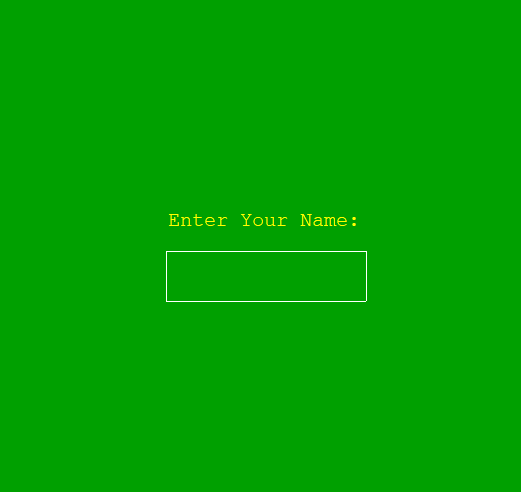
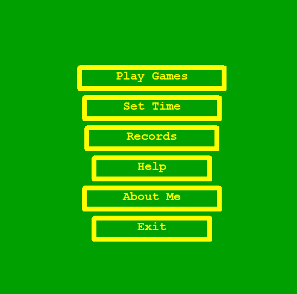
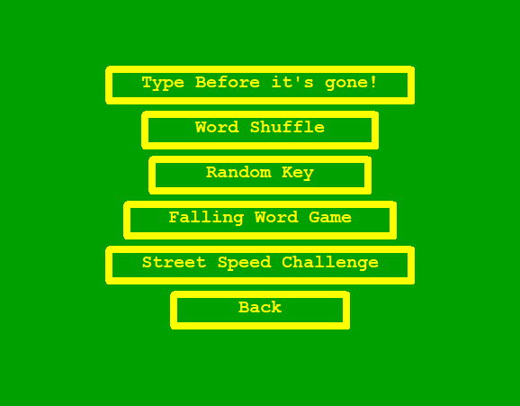
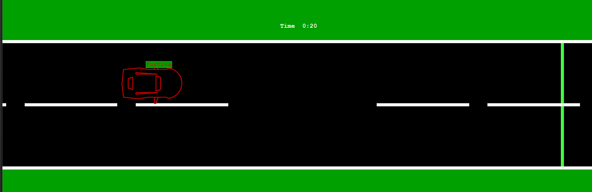
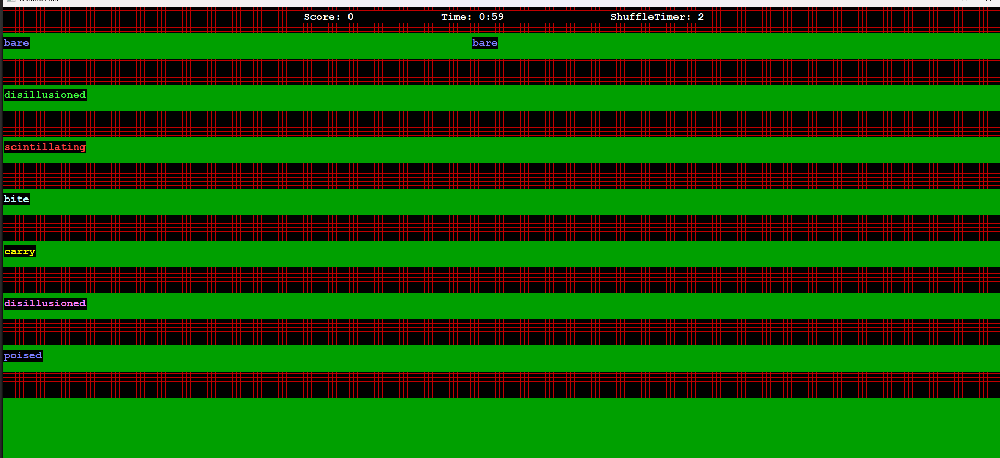
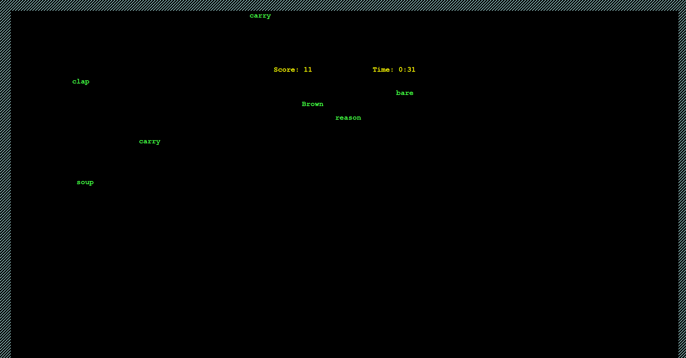
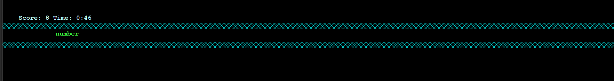

# Type Before It's Gone! - Typing Game Collection

A comprehensive typing game suite developed in C++ using graphics.h library, created for software exhibitions and coding competitions in 2019-20.









## 🎮 Game Features

### Five Exciting Game Modes:

1. **Type Before it's Gone!** - Race against time as words move across the screen
2. **Word Shuffle** - Words change position every few seconds, test your adaptability
3. **Random Key** - Simple character typing to improve concentration
4. **Falling Word Game** - Catch and type words falling from above
5. **Street Speed Challenge** - Drive a vehicle by typing words to accelerate

### Core Features:

- ✅ Player name input and personalization
- ✅ Configurable game duration (30 seconds, 1 minute, 2 minutes)
- ✅ High score tracking with file persistence
- ✅ Mouse and keyboard controls
- ✅ Pause/Resume functionality
- ✅ Colorful graphics interface
- ✅ Sound effects and visual feedback

## 🚀 Getting Started

### Prerequisites

- Windows operating system
- C++ compiler with graphics.h support (Turbo C++/Dev-C++)
- Graphics library (BGI)

### Installation

1. Clone the repository:

```bash
git clone https://github.com/yourusername/Type-Before-It-s-Gone-.git
cd Type-Before-It-s-Gone-
```

2. Compile the code:

```bash
g++ -o typing_game main.cpp -lgraph
```

3. Run the game:

```bash
./typing_game
```

## 🎯 How to Play

1. **Start the Game**: Enter your name when prompted
2. **Choose Game Mode**: Select from 5 different typing challenges
3. **Set Timer**: Configure game duration before starting
4. **Play**: Type the displayed words/characters as fast as possible
5. **Pause**: Press ESC during gameplay to pause
6. **View Records**: Check high scores and records

### Game Controls:

- **Mouse**: Navigate menus and buttons
- **Keyboard**: Type words and characters
- **ESC**: Pause game
- **Enter**: Confirm selections

## 🏗️ Project Structure

```
Type-Before-It-s-Gone-/
├── main.cpp              # Main game source code
├── README.md            # Project documentation
├── High_Score.txt       # High scores storage (auto-generated)
├── Records.txt          # Game records storage (auto-generated)
└── screenshots/         # Game screenshots
```

## 🔧 Technical Details

### Built With:

- **Language**: C++
- **Graphics Library**: graphics.h (BGI)
- **Platform**: Windows
- **File I/O**: Standard C++ file streams

### Key Components:

- [`Word`](main.cpp) class - Manages word objects with physics
- [`Vehicle`](main.cpp) class - Handles car movement in street game
- [`Button`](main.cpp) class - Interactive UI elements
- Game state management and scoring system
- File-based persistence for scores and records

### Game Mechanics:

- Dynamic word generation from predefined dictionary
- Physics simulation for falling and moving objects
- Timer-based gameplay with multiple difficulty levels
- Score calculation based on typing accuracy and speed

## 🏆 Competition History

This game was developed for participation in:

- **MUET Software Exhibition** (2019-20)
- **Quest Software Exhibition** (2019-20)
- Various **Coding Competitions** (2019-20)

## 📊 Game Statistics

The game tracks various metrics:

- Words per minute (WPM)
- Typing accuracy
- High scores per game mode
- Player records and achievements

## 🛠️ Development Notes

### Known Issues:

- Requires graphics.h library (legacy Windows graphics)
- Some display functions use goto statements (vintage C++ style)
- Mouse coordinates may need adjustment for different screen resolutions

### Future Improvements:

- Port to modern graphics library (SDL/SFML)
- Add network multiplayer support
- Implement difficulty levels
- Add more word categories
- Sound effects and background music

## 🤝 Contributing

Contributions are welcome! Feel free to:

1. Fork the project
2. Create a feature branch (`git checkout -b feature/AmazingFeature`)
3. Commit your changes (`git commit -m 'Add some AmazingFeature'`)
4. Push to the branch (`git push origin feature/AmazingFeature`)
5. Open a Pull Request

## 📝 License

This project is licensed under the MIT License - see the [LICENSE](LICENSE) file for details.

## 👨‍💻 Author

**Syed Sulaiman Shah**

- University of Sindh - BS Software Engineering
- Location: Bypass Town Moro

## 🙏 Acknowledgments

- Thanks to the organizers of MUET and Quest software exhibitions
- Inspiration from classic typing games
- Graphics.h community for legacy graphics support

---

⭐ **Star this repository if you found it helpful!** ⭐

_"Developed with passion during university days - a nostalgic journey into C++ graphics programming!"_
